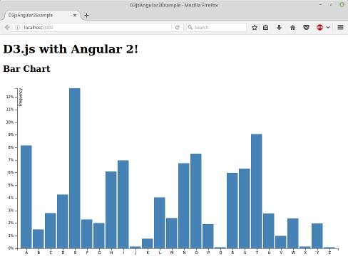

# Gráfico de barras

Vamos a implementar el ejemplo descrito en [Gráfico de barras] (http://bl.ocks.org/mbostock/3885304)
por Mike Bostock en Angular 2.

## Prerequistos

Instalar [Node.js y NPM] (https://nodejs.org/en/) si no están ya instalados en el equipo.

> Compruebe que está ejecutando al menos node v6.x.x and npm 3.x.x mediante la ejecución node -v y npm -v en una ventana de terminal/consola. Versiones antiguas podrían producir errores.

Clonar este repositorio  en una nueva carpeta de proyecto si no está ya creado.

 ```bash
 $ git clone https://github.com/datencia/d3js-angular2-example.git
 ```

## Pasos

- Vaya a la carpeta del ejemplo.

 ```bash
 $ cd d3js-angular2-example/03_bar_chart
 ```

- Instalar los paquetes npm descritos en el archivo `package.json` y verificar que funciona:

 ```bash
 $ npm install
 ```
- Ejecutar el ejemplo:

 ```bash
 $ npm start
 ```

- A continuación, cargar http://localhost:8080/ en un navegador para ver la salida.

 
