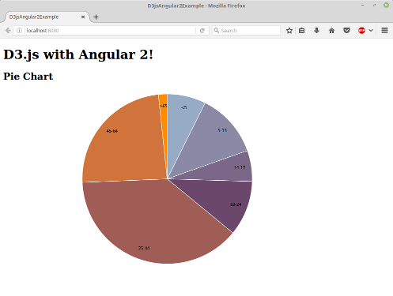

# Pie Chart

We'll implement the example described in [Pie Chart](http://bl.ocks.org/mbostock/3887235)
by Mike Bostock in Angular 2.

## Prerequisites

Install [Node.js and npm](https://nodejs.org/en/) if they are not already installed on your computer.

> Verify that you are running at least node v6.x.x and npm 3.x.x by running node -v and npm -v in a terminal / console window. Older versions may produce errors.

Clone this repo into a new project folder if it's not already done.

 ```bash
 $ git clone https://github.com/datencia/d3js-angular2-example.git
 ```

## Steps

- Navigate to the example folder.

 ```bash
 $ cd d3js-angular2-example/06_pie_chart
 ```

- Install the npm packages described in the `package.json` and verify that it works:

 ```bash
 $ npm install
 ```
- Execute the example:

 ```bash
 $ npm start
 ```

- Then, load http://localhost:8080/ in a browser to see the output.

 
