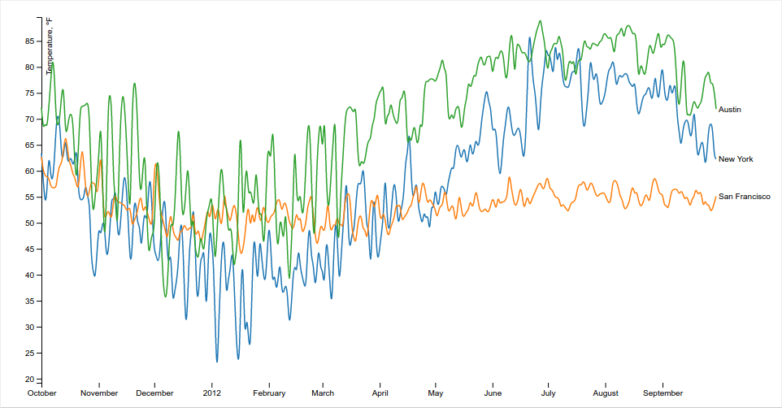

# d3js-angular2-example

This project shows how to integrate D3.js with Angular 2.

We'll implement an example that uses the article [Multi-Series Line Chart](http://bl.ocks.org/mbostock/3884955)
by Mike Bostock as the starting point to then migrate it to Angular2.

## Prerequisites

Install [Node.js and npm](https://nodejs.org/en/) if they are not already installed on your computer.

> Verify that you are running at least node v6.x.x and npm 3.x.x by running node -v and npm -v in a terminal / console window. Older versions may produce errors.
